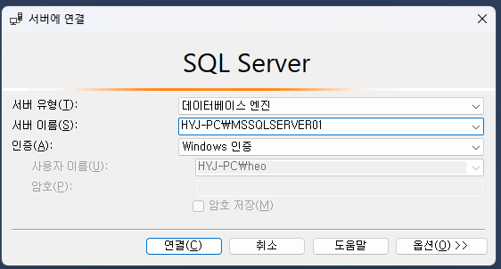
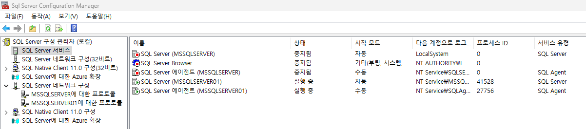
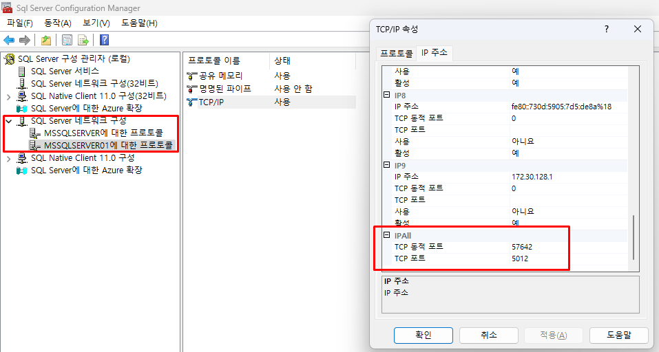
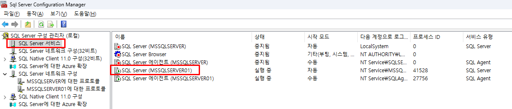
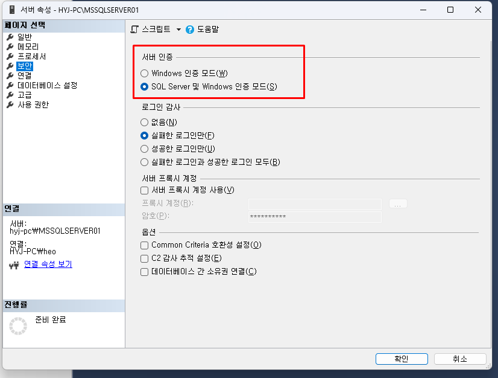
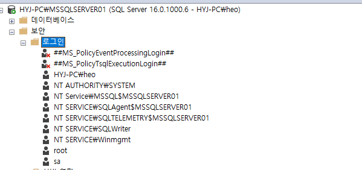
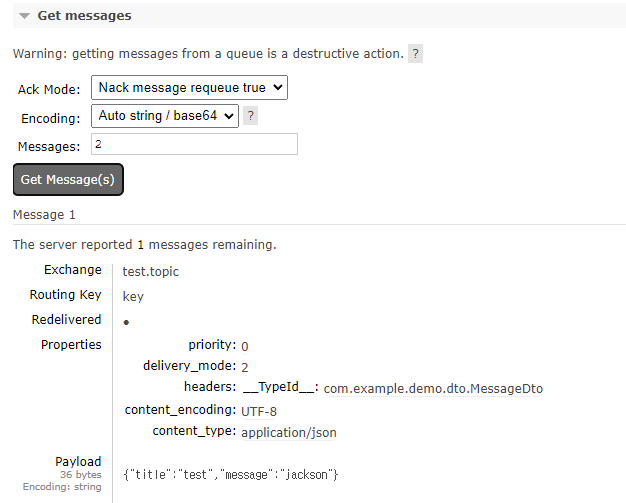
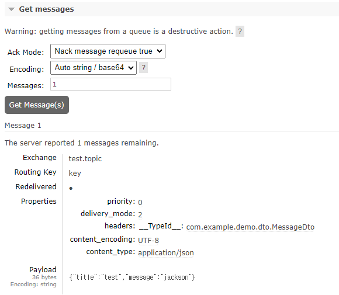

# 세팅 참고
```cmd
netstat -ano | findstr 포트번호
```
### MSSQL
로컬 설치 : https://develop-writing.tistory.com/22

### Eclipse Temurin JDK
https://adoptium.net/temurin/releases/

### rabbit MQ (docker)
https://velog.io/@divan/RabbitMq-%EC%84%A4%EC%B9%98


# 여기서 할 것
1. RabbitMQ 메시지
   </br>https://www.rabbitmq.com/tutorials/tutorial-one-java (rabbit MQ 공식)
   </br>https://spring.io/guides/gs/messaging-rabbitmq (스프링부트 공식)
   </br>https://github.com/spring-projects/spring-amqp-samples (샘플 소스)
   </br>https://adjh54.tistory.com/292 (상세한블로그)


2. swagger (springdoc - fox 아님)
   </br>https://springdoc.org/#getting-started (공식)
   </br>[상세한 블로그 참고](https://hogwart-scholars.tistory.com/entry/Spring-Boot-SpringDoc%EA%B3%BC-Swagger%EB%A5%BC-%EC%9D%B4%EC%9A%A9%ED%95%B4-API-%EB%AC%B8%EC%84%9C%ED%99%94-%EC%9E%90%EB%8F%99%ED%99%94%ED%95%98%EA%B8%B0#Spring%20Boot%203%EC%97%90%EC%84%9C%20Swagger%20%EC%82%AC%EC%9A%A9%ED%95%98%EA%B8%B0-1)


3. CDC 개념 공부

# MSSQL 설정

그냥 설치해서 ms sql server management studio 에서 이렇게 연결되길래 ㅇㅋ 했는데
intellij 에서 연결이 안 됨

</br>(1) 포트지정
</br>(2) user/password 인증으로 바꿔줘야 함

### (1) 포트지정하기

sql server configuration manager (msqql 네트워크 관리를 하는 설정 툴) 를 켠다

SQL 네트워크 구성 > [사용할db]에 대한 프로토콜 > TCP/IP > IP 주소 탭에서
</br>IP1, ...IP9 중 사용할 IP와 IP all 에다가 포트 할당

재시작

### (2) 사용자 인증으로 변경하기

기본값이 windows 인증이라서 SQL server 인증으로 변경해야 함
</br>localhost 는 windows 인증이 가능한데, IP 주소로 연결하기 위해선 username/password 로 하라 그럼


대충 로그인할 어드민 계정을 만든다
</br> * 비밀번호 필수 (intellij 에서 비밀번호 없으면 뭔 클라이언트크리덴션 에러냄)

### (3) 스프링부트 yml 설정
```yml
spring:
  datasource:
    driver-class-name: com.microsoft.sqlserver.jdbc.SQLServerDriver
    url: jdbc:sqlserver://localhost:5012;databaseName=tempdb;encrypt=true;trustServerCertificate=true
    username: sa
    password: 123
```
저 url 뒤, __encrypt, certificate__ 설정을 해야 동작함

# Rabbit MQ 메시지 형식

```java
 public void sendMessageTestJson(MessageDto messageDto) throws JsonProcessingException {
     ObjectMapper om = new ObjectMapper();
     String toJson = om.writeValueAsString(messageDto);

     log.error("보냄-json");
     log.error(toJson);
     rabbitTemplate.convertAndSend(exchangeName, key, toJson);
 }
```
### 1. send json receive json (String to String)
```java
 @RabbitListener(queues = "test")
 public void receiveJson(String msg) {
     log.error("받음-json");
     log.info("---{}", msg);
 }
```
### 2. send json receive Message (String to Message(object))
```java
 @RabbitListener(queues = "test")
 public void receiveJson(Message dto) {
     log.error("받음-json2");
     log.info("---{}", dto.toString());
 }
```
### 3. send Object receive Object

```java
public void sendMessageTest(MessageDto messageDto) throws JsonProcessingException {
   log.error("보냄-object");
   rabbitTemplate.convertAndSend(exchangeName, key, messageDto);
}
    
 @RabbitListener(queues = "test")
 public void receiveJson(MessageDto dto) {
     log.error("받음-object");
     log.info("---{}", dto.toString());
 }
```
